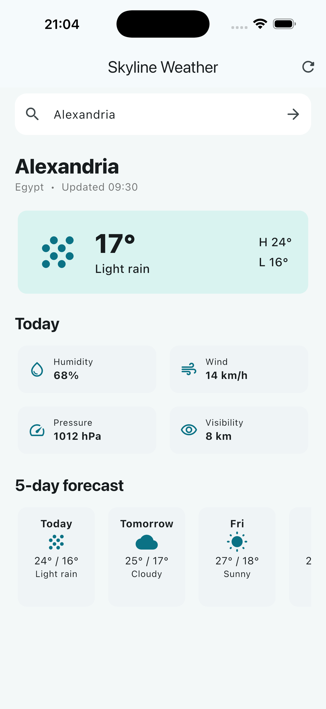

# Skyline Weather

A clean Flutter weather dashboard with city search, explicit loading and error states, current conditions, weather metrics, and a horizontally scrollable five-day forecast.

## App Preview

The screenshot below was captured from the running app on an iPhone 17 Pro Max simulator.


## Features

- Loads Alexandria weather on startup.
- Searches supported cities from the main screen.
- Displays current temperature, condition, high and low temperatures.
- Displays humidity, wind speed, pressure, and visibility.
- Displays a five-day horizontal forecast.
- Supports refresh from the app bar and pull-to-refresh.
- Shows dedicated loading, empty, success, and error states.
- Provides user-friendly messages for empty searches, unknown cities, offline mode, and service failures.
- Uses Material 3 and responsive scrolling layouts for small screens.

## Architecture

The project uses a small layered structure:

```text
Presentation
  HomeView + WeatherController
	|
Domain  Weather + ForecastDay
	|
Data    WeatherRepository
```

- **Presentation:** `HomeView` renders the UI. `WeatherController` owns the request state and notifies the view when it changes.
- **Domain:** `Weather`, `ForecastDay`, and `WeatherIcon` define the weather data used by the presentation layer.
- **Data:** `WeatherRepository` exposes `fetchWeather` and translates lookup failures into `WeatherException` messages.

## Tech Stack

| Technology | Purpose |
| --- | --- |
| Flutter | Cross-platform UI framework |
| Dart 3.12.2 or newer within the project SDK constraint | Application language |
| Material 3 | Theme and UI components |
| `flutter_test` | Widget and unit tests |
| `flutter_lints` | Static analysis and style rules |

## Project Structure

```text
lib/
├── data/
│   └── weather_repository.dart
├── domain/
│   └── weather.dart
├── presentation/
│   └── weather_controller.dart
├── views/
│   └── home_view.dart
└── main.dart
test/
└── widget_test.dart
assets/
└── screenshots/
    └── weather-overview.png
```

## Data Source

The current implementation uses an in-memory repository because this repository does not define an API endpoint, API key, or HTTP client. The repository includes sample data for:

- Alexandria, Egypt
- Cairo, Egypt
- London, United Kingdom

The following search values intentionally exercise error states during development:

| Search value | Result |
| --- | --- |
| Empty input | Prompts the user to enter a city |
| `offline` | Shows a no-internet message |
| `error` | Shows a weather-service failure message |
| Any unsupported city | Shows an unknown-city message |

To connect a real weather API, replace the implementation inside `WeatherRepository` while keeping its `Future<Weather> fetchWeather(String city)` contract.

## Installation

1. Install the Flutter SDK compatible with the SDK constraint in `pubspec.yaml`.
2. Clone this repository and open it in VS Code or Android Studio.
3. Fetch dependencies:

   ```bash
   flutter pub get
   ```

## Run

List available devices:

```bash
flutter devices
```

Run on a selected device or simulator:

```bash
flutter run -d <device-id>
```

For example:

```bash
flutter run -d macos
```

## Testing

Run the test suite:

```bash
flutter test
```

The tests cover:

- Initial loading and successful weather rendering.
- Searching for another supported city.
- Friendly messaging for an unknown city.
- Repository handling for offline and empty-input states.

Run static analysis with:

```bash
flutter analyze
```

## Current Limitations

- Weather data is local sample data and is not live.
- There is no device-location permission flow.
- There is no localization configuration yet; the current interface is English.
- Sunrise, sunset, and API-backed historical data are not currently modeled.

## Future Improvements

- Add an HTTP data source and environment-based API configuration.
- Add location services with permission and service-disabled states.
- Add persistent recent searches and cached weather.
- Add localization and unit preferences for temperature, wind, and distance.
- Expand unit, widget, and integration test coverage once the live data source is introduced.
